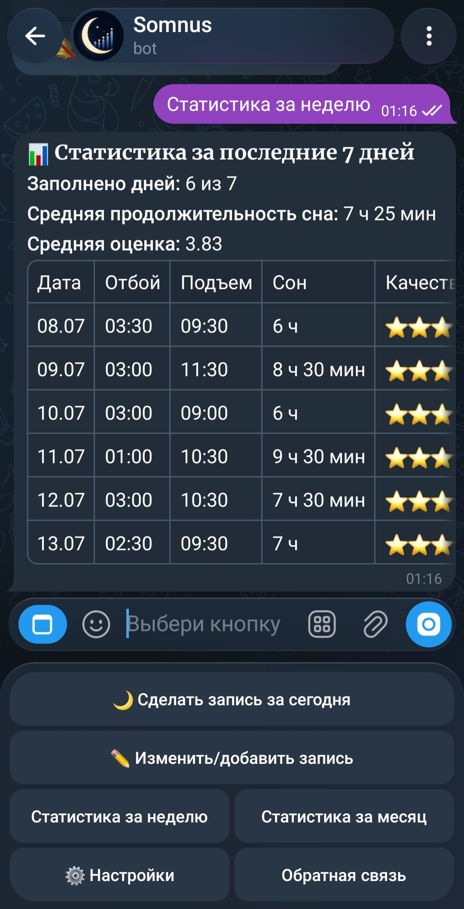
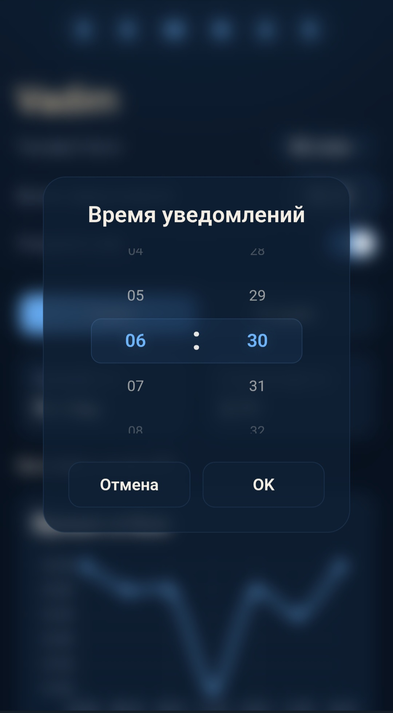
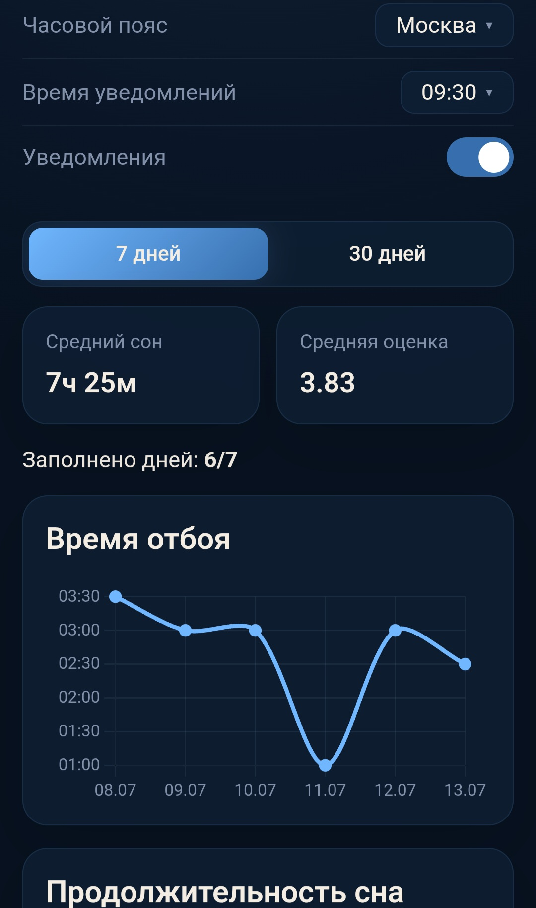

# Sleepmeter TG Bot

Telegram-бот для ведения дневника сна. Позволяет ежедневно записывать данные о сне, получать статистику и получать напоминания о необходимости внести запись.

## Возможности

- Ежедневный дневник сна
- Настраиваемые ежедневные напоминания
- Поддержка часовых поясов
- Расчет статистики сна
- Редактируемый профиль пользователя
- Обратная связь

## Стек

- Python 3.12.3
- aiogram 3.30.0
- FastAPI
- SQLAlchemy
- Alembic
- MySQL

## Скриншоты

<table align="center">
  <tr>
    <td style="padding: 0 8px;">
      
    </td>
    <td style="padding: 0 8px;">
      
    </td>
    <td style="padding: 0 8px;">
      
    </td>
  </tr>
  <tr>
    <td align="center">Главное меню</td>
    <td align="center">Напоминания</td>
    <td align="center">Web-интерфейс</td>
  </tr>
</table>
